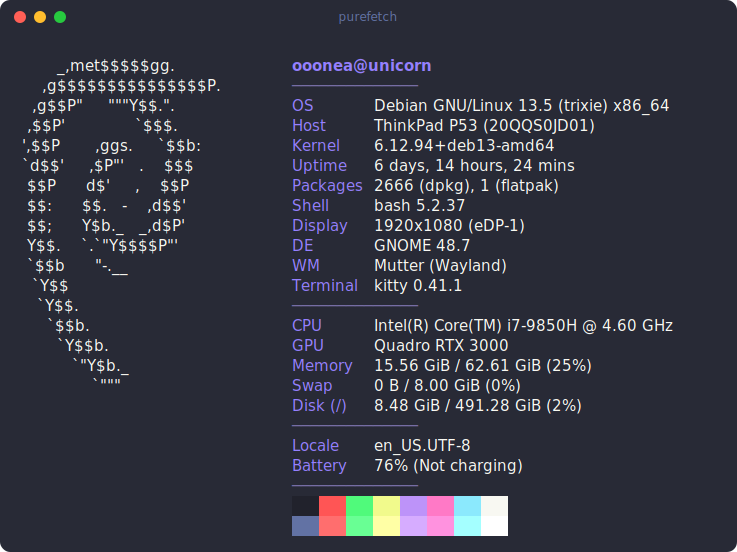

# purefetch

[](https://github.com/ooonea/purefetch/actions/workflows/ci.yml)
[](https://crates.io/crates/purefetch)
[](#license)


A small, fast system-information tool — a [fastfetch](https://github.com/fastfetch-cli/fastfetch)-style
fetcher written **entirely in Rust with zero external crates**.

No `libc`, no `sysinfo`, no `nix`, no color crate — nothing from crates.io. The
handful of syscalls that have no `std` wrapper (`statfs`, `ioctl` for the
terminal size / tty check) are issued directly as raw Linux syscalls (x86_64,
aarch64, riscv64 and loongarch64) via `core::arch::asm!` in `src/sys.rs`.
Everything else is `std` plus parsing of `/proc` and `/sys`. It builds offline
and has a trivial dependency graph.

<p align="center"></p>

```
       _,met$$$$$gg.          ooonea@unicorn
    ,g$$$$$$$$$$$$$$$P.       ──────────────
  ,g$$P"     """Y$$.".        OS        Debian GNU/Linux 13.5 (trixie) x86_64
 ,$$P'              `$$$.     Host      ThinkPad P53 (20QQS0JD01)
',$$P       ,ggs.     `$$b:   Kernel    6.12.94+deb13-amd64
`d$$'     ,$P"'   .    $$$    Uptime    6 days, 14 hours, 21 mins
 $$P      d$'     ,    $$P    Packages  2422 (dpkg), 1 (flatpak)
 $$:      $$.   -    ,d$$'    Shell     zsh 5.9
 $$;      Y$b._   _,d$P'      Display   1920x1080 (eDP-1)
 Y$$.    `.`"Y$$$$P"'         DE        GNOME 48.7
 `$$b      "-.__              WM        Mutter (Wayland)
  `Y$$                        Terminal  kitty 0.41.1
   `Y$$.                      CPU       Intel(R) Core(TM) i7-9850H @ 4.60 GHz
     `$$b.                    GPU       Quadro RTX 3000
       `Y$$b.                 Memory    15.46 GiB / 62.61 GiB (25%)
          `"Y$b._             Swap      0 B / 8.00 GiB (0%)
              `"""            Disk (/)  8.16 GiB / 491.48 GiB (2%)
                             Locale    en_US.UTF-8
                             Battery   76% (Not charging)
```

## Install

With a Rust toolchain (1.70+):

```sh
cargo install purefetch
```

Or straight from the repo (latest `main`):

```sh
cargo install --git https://github.com/ooonea/purefetch
```

Or build from source:

```sh
git clone https://github.com/ooonea/purefetch
cd purefetch
cargo build --release
./target/release/purefetch
# optional: install to ~/.cargo/bin
cargo install --path .
```

Targets **Linux** on **x86_64**, **aarch64**, **riscv64**, and **loongarch64**.

## Usage

```
purefetch [OPTIONS]

-l, --logo <NAME>       logo: auto (default), or a distro name (see below)
    --logo-file <PATH>  use a custom logo, read verbatim from a file
    --modules <LIST>    comma-separated modules to show ('-' = separator)
    --exec <LABEL:CMD>  add a custom line from a shell command (ref in --modules)
    --no-logo           do not print any logo
    --no-color          disable ANSI colors
    --no-color-blocks   hide the trailing ANSI color blocks
-V, --version           print version and exit
-h, --help              print this help and exit
```

Colors are disabled automatically when stdout is not a terminal (or when
`NO_COLOR` is set), so `purefetch | cat` produces clean, unstyled text.

Bundled logos: `arch`, `ubuntu`, `fedora`, `debian`, `mint`, `manjaro`, `pop`,
`opensuse`, `alpine`, `void`, `nixos`, `gentoo`, `endeavouros`, `kali`,
`elementary`, `zorin`, `artix`, `rocky`, `almalinux`, `centos`, `devuan`, `mx`,
`garuda`, `tux` (and `none`). `auto` picks one from `/etc/os-release`, falling
back to `tux`.

## Detected info

`Title (user@host)`, `OS`, `Host`, `Kernel`, `Uptime`, `Packages`, `Shell`,
`Display`, `DE`, `WM`, `Terminal`, `CPU`, `GPU`, `Memory`, `Swap`, `Disk (/)`,
`Locale`, `Battery`, and the ANSI color blocks. Any module whose data is
unavailable (e.g. `Battery` on a desktop, `Swap` with no swap) is silently
skipped.

## Notable details

- **Zero dependencies.** The whole tool is `std` + raw syscalls (`src/sys.rs`).
- **ZFS-aware memory.** On ZFS-on-root, the ARC is kernel-slab cache that
  `MemAvailable` does not count as free, so a naive `total - available` grossly
  over-reports used RAM. `purefetch` subtracts the reclaimable ARC
  (`arcstats size - c_min`), matching fastfetch and htop-with-ZFS.
- **Process-parent detection.** `Shell` and `Terminal` walk the `/proc/<pid>`
  parent chain (parsing `ppid` after the last `)` in `stat`, reading the clean
  name from `comm`), with environment-variable fallbacks (`$TERM`,
  `$KITTY_WINDOW_ID`, ...) for the terminal.
- **Best-effort everywhere.** No module ever panics or blocks; missing data just
  drops its line.

## Architecture

```
src/
  main.rs        arg parsing, module ordering, title/separators/color blocks, dispatch
  sys.rs         raw Linux syscalls (x86_64, aarch64, riscv64, loongarch64): statfs, ioctl
  util.rs        file helpers, subprocess helper, byte/percent formatting
  color.rs       ANSI palette
  logo.rs        distro ASCII logos + selection (generated by examples/genlogos.rs)
  render.rs      logo-left / info-right layout, ANSI-aware width & truncation
  detect/
    mod.rs       Row/Rows contract + module registry
    *.rs         one module per info line (os, cpu, gpu, memory, ...)
```

Adding an info source is one file: implement
`pub fn detect() -> crate::detect::Rows` in `src/detect/<name>.rs` and register
it in `src/main.rs`. Adding a distro logo is one text file in `assets/logos/`
followed by `cargo run --example genlogos`.

## Contributing

See [CONTRIBUTING.md](CONTRIBUTING.md). New distro logos, more package managers,
extra info modules, and support for other CPU architectures are all welcome —
please keep the zero-dependency rule and run `cargo fmt` before submitting.

## Disclosure

purefetch was built largely with **AI assistance** (Claude Code). The design was
human-directed and every change was reviewed and tested — including running the
tool on all four supported architectures under QEMU — but most of the code is
AI-generated. Noting it openly so you know how it was made.

## License

Licensed under either of

- MIT license ([LICENSE-MIT](LICENSE-MIT))
- Apache License, Version 2.0 ([LICENSE-APACHE](LICENSE-APACHE))

at your option.

Unless you explicitly state otherwise, any contribution intentionally submitted
for inclusion in the work by you, as defined in the Apache-2.0 license, shall be
dual licensed as above, without any additional terms or conditions.
